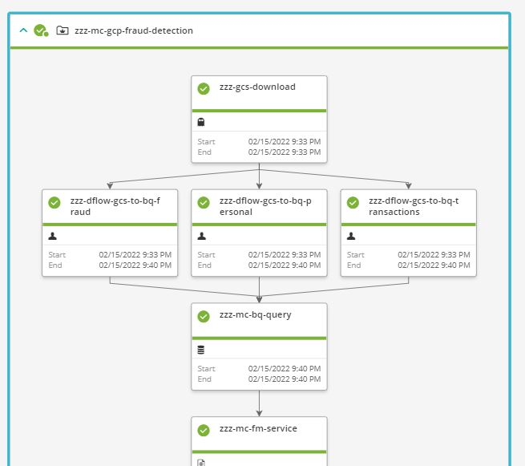

# GCP Fraud Detection Model

## Introduction
> Maintainer: [joe_goldberg@bmc.com](mailto:joe_goldberg@bmc.com)

This flow is ordered daily in the AWS Production Demo System.

## Use Case Overview
Three CSV files containing new transaction data, historical fraud data, and personal information are dropped into storage. The new data is added to the transaction history, and fraud detection models can then be tested against the new data. The services used here are Google Cloud Storage, Google Cloud Dataflow, and Google BigQuery.

## Use Case Technical Explanation
This workflow features accessing Google Cloud Storage and AWS S3 using S3 Compatibility support in Control-M Managed File Transfer, Application Integrator job type for GCP Dataflow provided by the Integrations team in GitHub, and Control-M for Databases support for BigQuery via the Simba JDBC driver recommended by Google.

## Job Types Included
- MFT (AWS S3 to GCP Storage Transfer)
- AI Dataflow
- Database Embedded Query (BigQuery)
- SLA Management

## Usage Instructions
- The folder that is ordered daily in Production is **zzz-mc-gcp-fraud-detection**.

## Screenshot of Demo Flow

