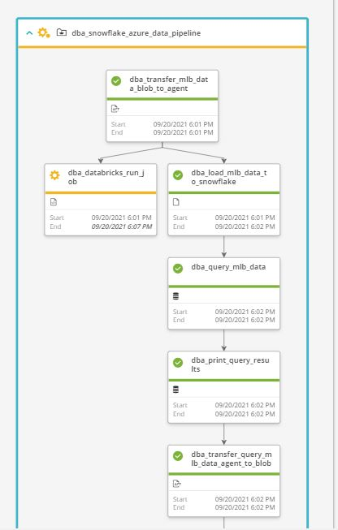

# Azure Data Pipeline
## Introduction
> Maintainer: <brandi_coleman@bmc.com>

The On-Demand Demo Service for this flow takes approximately 8 minutes to complete.

See <b>Usage Instructions</b> below for steps to interact with this flow.

This use case is available for the AWS Demo System and Helix Control-M Production Demo System via the OnDemand Demo and OnDemand Helix Demo orderable services.

## Use Case Overview 
This workflow will utilize Snowflake, Azure Blob, and Azure Data Factory, and Azure Databricks to select and store baseball statistics for a specific team from a larger database. 

## Use Case Technical Discussion
The workflow begins with a File Transfer of two csv files containing baseball statistics from an Azure Blob storage to the local the local file system on the Agent. The snowsql CLI is installed for this workflow and will run a SQL script to combine the csv files and load the data into a large table within Snowflake. The workflow will then run a Snowflake query for a specific team stored in a Control-M variable. The next job will do a select on that table with an on-do action to copy the table into a csv file on the Agent. The data is then moved from the local Agent back to Azure Blob. The Azure Data Factory job type will then copy file from the incoming folder in Azure Blob over to an outcoming folder. **Upcoming addition - PowerBI Reporting**.

To view the demo flow code-base please navigate to the [Snowflake and Azure Data Pipeline Git Repository](https://ctm-git.trybmc.com/automated-demos/azure-data-pipeline/-/tree/master)

## Job Types Included  
- File Transfer (Azure Blob)
- File Transfer (Local File System)
- OS
- Database Embedded Query (Snowflake)
- AI Azure Data Factory
- AI Azure Databricks

## Usage Instructions
- Update Control-M Folder-level variables, <b> TEAM</b>, with a valid value
- You can find a list of valid values [here](https://en.wikipedia.org/wiki/Wikipedia:WikiProject_Baseball/Team_abbreviations)

## Screenshot of Demo Flow

